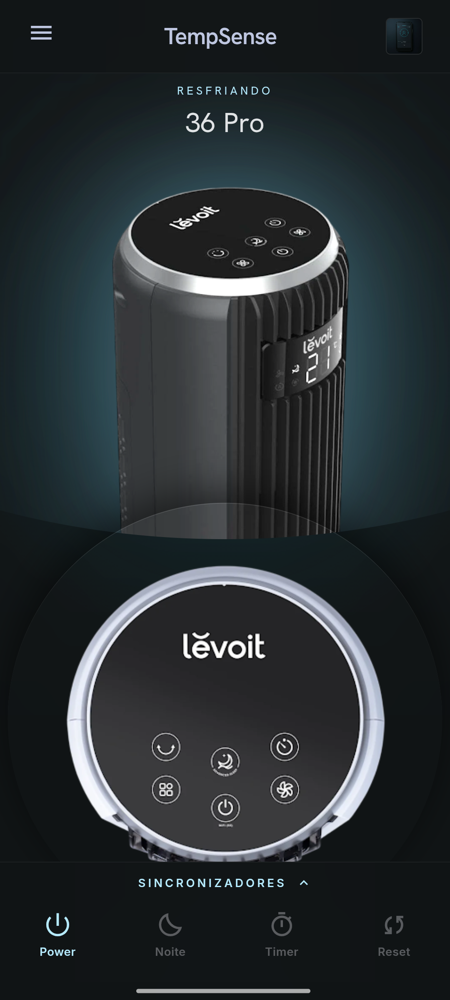

# Remote IR compativel com Levoit TempSense 36 Pro

> **Projeto independente e nao oficial.** Este projeto nao e afiliado, aprovado, patrocinado ou endossado pela Levoit. Levoit e TempSense sao marcas dos seus respetivos proprietarios.

> **Uso nao comercial:** este projeto e disponibilizado sob a [PolyForm Noncommercial License 1.0.0](LICENSE). O uso e gratuito apenas para fins pessoais e nao lucrativos. E proibida a venda do APK, do codigo ou de versoes derivadas sem autorizacao escrita.

Android IR remote APK compatible with the Levoit TempSense 36 Pro tower fan. It is designed for Android phones with built-in infrared hardware, including compatible Xiaomi and Redmi devices.

This is a source-available, non-commercial compatibility tool. It sends NEC infrared commands through Android's native `ConsumerIrManager` API and works offline, without Wi-Fi, Bluetooth pairing, or account login.

Useful for people searching for a remote IR app compatible with Levoit TempSense 36 Pro, Xiaomi IR blaster remote, Redmi IR remote, Android infrared remote, NEC protocol fan remote, or a replacement remote app for a compatible tower fan.



## Download APK

- Direct APK download: https://github.com/jjoaotonesco-blip/levoit-tempsense-36-pro-remote-ir/raw/main/Levoit-TempSense-36-Pro-Remote-IR-v1.0.apk
- Repository APK copy: [`Levoit-TempSense-36-Pro-Remote-IR-v1.0.apk`](Levoit-TempSense-36-Pro-Remote-IR-v1.0.apk)
- GitHub release page: https://github.com/jjoaotonesco-blip/levoit-tempsense-36-pro-remote-ir/releases/latest
- GitHub Pages landing page: https://jjoaotonesco-blip.github.io/levoit-tempsense-36-pro-remote-ir/
- Package name: `pt.local.levoitir`
- Current app version: `1.0`
- Current APK SHA-256: `B87E1B4A4A678674BED73DBF8E60292CFB40A6472A1D943D6151A4DFD4CC97B4`

## Features

- Power on/off
- Fan speed up/down
- Mode button
- Timer button
- Swing / oscillation
- Sleep / night mode
- Sound / mute button
- Saved screen flip mode for external IR adapter setups
- Local sync controls for matching the app display to the real tower state
- WebView UI with Android native IR bridge

## Device Support

The app sends NEC infrared commands through Android's native `ConsumerIrManager`.

It requires one of these:

- an Android phone with built-in IR hardware
- a compatible external IR transmitter exposed through Android's consumer IR API

It will not work on devices without compatible IR hardware.

## Portuguese / Portugues

App Android de comando remoto IR compativel com a torre Levoit TempSense 36 Pro. Funciona em telemoveis com emissor infravermelho integrado, como alguns Xiaomi, Redmi e POCO, e pode funcionar com transmissores IR externos compativeis com a API Android `ConsumerIrManager`.

Este projeto e independente e nao oficial. Nao e afiliado, aprovado, patrocinado ou endossado pela Levoit.

Termos comuns: comando remoto IR compativel com Levoit TempSense 36 Pro, app IR Xiaomi, app IR Redmi, telecomando infravermelho Android, comando substituto compativel, APK Android IR.

## Compatible Use Cases

- Remote IR app compatible with Levoit TempSense 36 Pro
- Android phone IR blaster remote control
- Xiaomi and Redmi infrared remote app
- NEC infrared protocol remote app
- Replacement remote for compatible tower fan models
- Local offline IR remote without Wi-Fi or Bluetooth pairing
- Xiaomi built-in IR blaster fan remote
- Redmi built-in infrared remote
- Android `ConsumerIrManager` NEC MSB infrared remote

## Tested Setup

- Device: Redmi phone with integrated IR
- Protocol: NEC
- Working bit order: MSB
- Carrier frequency: 38 kHz

## Suggested GitHub Topics

Add these topics to the GitHub repository About section:

```text
levoit
tempsense
tempsense-36-pro
android
apk
ir-remote
infrared
ir-blaster
xiaomi
redmi
consumerirmanager
nec-protocol
nec-msb
tower-fan
fan-remote
replacement-remote
```

## Keywords

compatible with Levoit TempSense 36 Pro, Levoit TempSense 36 Pro remote APK, remote IR compatible with Levoit TempSense 36 Pro, unofficial Levoit TempSense remote, Android IR remote, Android infrared remote, Android IR blaster, Xiaomi IR blaster, Xiaomi IR remote, Redmi IR remote, Redmi Note IR blaster, NEC protocol, NEC MSB, ConsumerIrManager, tower fan remote app, IR remote APK, replacement remote app, comando remoto IR, telecomando infravermelho Android.

## Search Phrases

People may find this project through:

- "Levoit TempSense 36 Pro remote APK"
- "remote IR compatible with Levoit TempSense 36 Pro"
- "Levoit TempSense IR codes"
- "A05F807F Levoit NEC"
- "Xiaomi IR blaster Levoit fan"
- "Redmi IR remote Levoit TempSense"
- "Android ConsumerIrManager tower fan remote"
- "Levoit TempSense 36 Pro replacement remote"
- "comando remoto IR compativel com Levoit TempSense 36 Pro"

## Install

Download the signed APK directly:

```text
Levoit-TempSense-36-Pro-Remote-IR-v1.0.apk
```

Then install it on an Android device that supports IR.

## Source Code

The Android source code is available in this repository for review, personal use, study, and non-commercial modification. Commercial use is not allowed without prior written permission.

## License

This project is licensed under the [PolyForm Noncommercial License 1.0.0](LICENSE).

Commercial use, selling the APK, selling the code, paid redistribution, or using this project in a paid product or business context requires prior written permission from the author. See [TERMS.md](TERMS.md) for a Portuguese summary.

## Disclaimer

This is an independent and unofficial compatibility project. It is not affiliated with, approved by, sponsored by, or endorsed by Levoit.

Levoit and TempSense are trademarks of their respective owners. This project is an independent IR compatibility tool.
